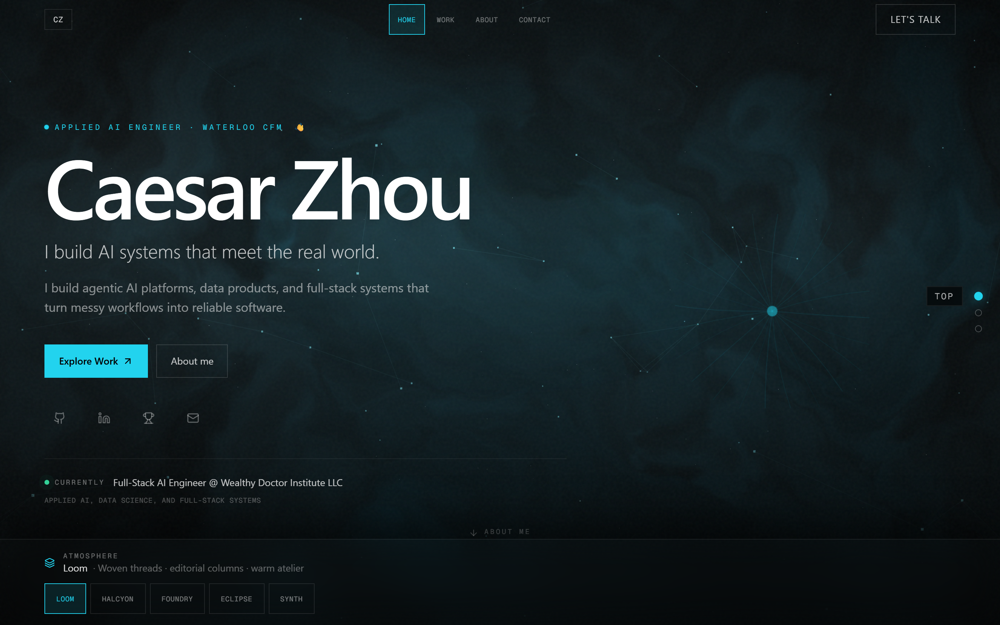
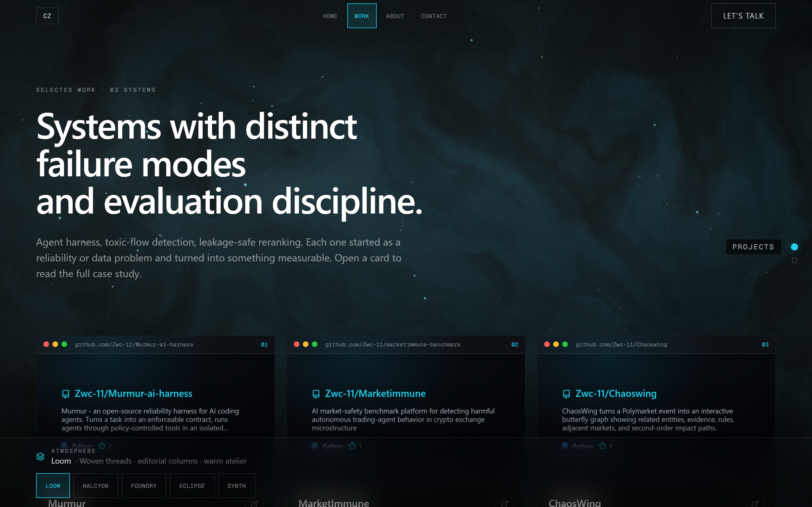
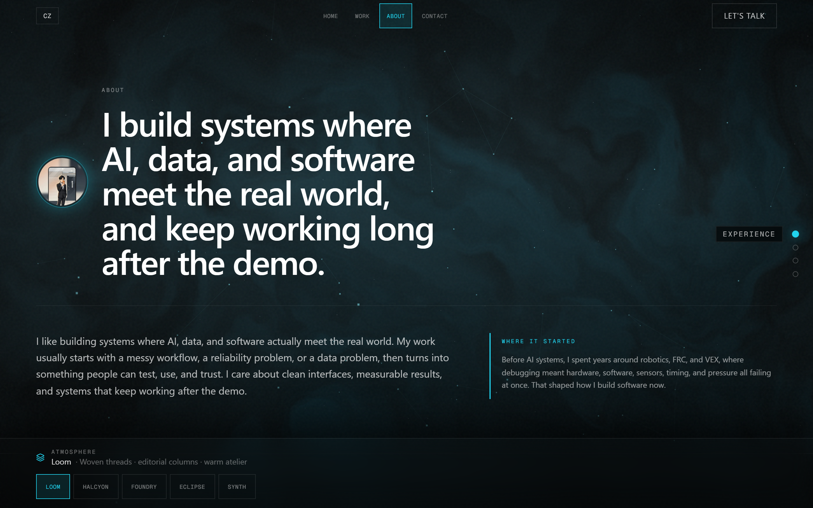

# Caesar Zhou — Portfolio

A cinematic, single-page-feel personal portfolio for **Caesar Zhou** — Applied AI, Data Science, and Full-Stack engineer. Built with **Vite + React 19 + Tailwind CSS** on the frontend and a lightweight **Node.js + Express** API on the backend.

The site pairs an editorial typographic layout with a live **three.js constellation field**, a custom cursor, a preloader, scroll-driven motion, and a switchable **atmosphere system** (Loom · Halcyon · Foundry · Eclipse · Synth) that retints the whole experience and its generative hero visual on the fly.



## Highlights

- **Five live atmospheres** — switch themes (and the generative hero core) without a reload via the on-screen Atmosphere switcher.
- **three.js background** — a reactive constellation / nebula field rendered with `@react-three/fiber` + `drei`, lazy-loaded so first paint stays fast.
- **Motion, done tastefully** — Framer Motion page transitions, magnetic buttons, scramble-in headline, scroll progress, and section page-dots — all disabled under `prefers-reduced-motion`.
- **Accent system** — cyan / amber / violet accents driven by CSS variables and `data-accent`.
- **Data-driven** — profile, projects, experience, skills, hackathons, and awards are served from the Express API, so content lives in one place.

## Stack

| Layer | Tech |
|-------|------|
| Client | React 19, Vite 6, Tailwind CSS 3, Framer Motion, three.js / @react-three/fiber + drei, react-router 7, lucide-react |
| Server | Node.js, Express — JSON API + static production build |
| Tooling | Concurrently (dev), Geist + Geist Mono fonts |

## Quick start

```bash
npm run install:all   # install root, client, and server deps
npm run dev           # run client + server together
```

- **Frontend (dev):** http://localhost:5173
- **API:** http://localhost:3001/api

The Vite dev server proxies `/api` to Express automatically.

## Production

```bash
npm run build   # builds the client into server/public
npm start       # Express serves the API + static site on port 3001
```

Then open http://localhost:3001.

## Project structure

```
client/                 Vite + React app
  src/
    pages/              Home, Work, Project detail, About, Contact
    layouts/            Atmosphere definitions (Loom / Halcyon / Foundry / Eclipse / Synth)
    components/
      hero/  core/      Generative hero visuals
      three/            three.js background scene
      interactive/      Cursor, preloader, scroll progress, page dots, magnetic buttons
      sections/ cards/  Content sections and project cards
      layout/           NavBar, Footer, layout switcher
    context/            Accent, Layout, and Data providers
    hooks/  api/         useReducedMotion, useMousePosition, fetch wrappers
server/                 Express API
  data/                 profile, projects, experience, skills, hackathons, awards
  routes/               /api/profile, /api/projects, /api/contact
  middleware/           CORS, contact validation
  public/               production build output (generated)
```

## API

| Route | Method | Description |
|-------|--------|-------------|
| `/api/profile`  | GET  | Name, headline, contact, about, experience, skills, proof strip |
| `/api/projects` | GET  | Selected project case studies |
| `/api/contact`  | POST | `{ name, email, message }` — validated, then logged server-side |

## Screens

| | |
|---|---|
|  |  |

## Troubleshooting

If `npm run dev` fails with **port already in use**, the `predev` script already runs `kill-port 3001 5173`. If a port is still held:

```bash
npx kill-port 3001 5173
npm run dev
```

---

Designed and built by Caesar Zhou. © Caesar Zhou.
